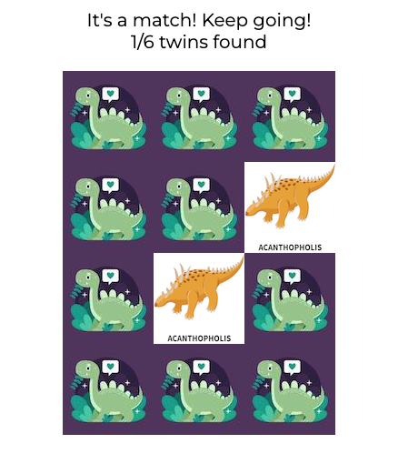
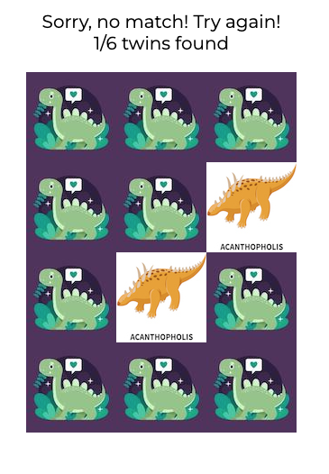

# Dinosaurs Memory Game
Dinosaurs Memory Game is a game to help children improve their memory along with having fun. The memory cards are also provided with information about the names of the different dinosaurs with the aim to educate children while playing the game. The memory board provides 12 cards containing dublettes of 6 different dinosaurs. The goal with the game is to find the dinosaur twins and pair them together.

## Features

### Existing features 

- Header
  - Featured on top of the page to indicate what type of game the user can expect.
  - Featured with a clear contrast to the background color and with a playful font in order to be inviting for children to play the game.
 

- Short description of the memory game 
  - The description provides the user with information about the memory game and which cards to pair together. 
   

- Initial move
  - A button is provided for the user to shuffle the memory cards.
  - Following with a text that tells the user to pick cards.
  - A score board is presented for the user that indicate that 0/6 twins are yet matched together.
   

- It's a match!
  - If the user picks matching cards, the user is informed by a text alert featured above the score board.
  - The chosen cards stay flipped to further indicate that the cards chosen are a match.
  - The scoreboard is updated in coherence with the number of found twins, allowing the user to keep scores.
   

- It's not a match!
  - If the user picks no matching cards, the user is informed by a text alert featured above the score board.
  - The chosen cards are flipped back to further inidcate that the chosen cards are not i match.
  - The scoreboard stays the same, allowing the user to keep the right scores.
   

- All twins found!
  - If the user matches all the dinosaur twins, the user is informed by a text alert featured above the score board.
  - All the cards are visible for the user to allow the user to learn the names of the different dinosaurs.
  - The scoreboard are is updated in coherence with the number of found twins 6/6.
   

- Restart the game
  - When the user is ready, the button to shuffle the cards is always ready to allow the user to restart the game.
   

- Footer
  - The footer features the game rules to provide for the user while playing the memory game.
   

### Features left to implement 

- Add number of attempts to display in the scoreboard, which would allow the user to keep track of attempts used for each game played.

## Testing

- I tested playing the game in different browsers: Chrome, Safari and Firefox.
- If the game is played correctly, I confirm that the result is correct.
- I confirm that all the texts are readable and easy to understand.
- I confirm that this memory game is responsive to all standard screens using the DevTools Device toolbar.
- I confirm that the fonts and colors are easy to read and accessible by running it through DevTools lighthouse:
   

### Validator testing
- HTML official W3C validator
  - Passed through validation without error.
- CSS offical (Jigsaw) validator
  - Passed through validation without error.

### Bugs
- Running through DevTools lighthouse I discovered that the images did not contain an alt attribute. I fixed this bug by adding the code setAttribute to the images in the javascript file. 

## Deployment 
The site was deployed to GitHub pages by following the steps listed below:

1. I navigated to 'My Repositories' in GitHub and selected the 'Bella_Art_Gallery' Repository
2. From the tab bar I opened 'Settings' and navigated to 'Pages' from the left side menu
3. I selected 'Deploy from branch' from the 'Source' drop-down menu
4. Below I selected the 'Main' branch and saved by clicking the 'Save' button

The deployment was successful! [Visit the deployed site here](https://elsahelg.github.io/dinosaurs-memory-game/)

## Credits

## Content
- The code to implement the main structure of the memory game board is credited to [Ania Kubów](https://www.youtube.com/watch?v=tjyDOHzKN0w&t=302s)

## Media
- The images of the memory cards are taken from Freepik and credited to [macrovector](https://www.freepik.com/free-vector/isometric-colored-dinosaurs-set_26764158.htm#page=2&query=dinosaurs&position=47&from_view=search&track=sph)
- The image for the back of the cards is credited to [Freepik](https://www.freepik.com/free-vector/hand-drawn-baby-dinosaur-illustrated_13861993.htm#page=6&query=dino&position=23&from_view=search&track=sph) 